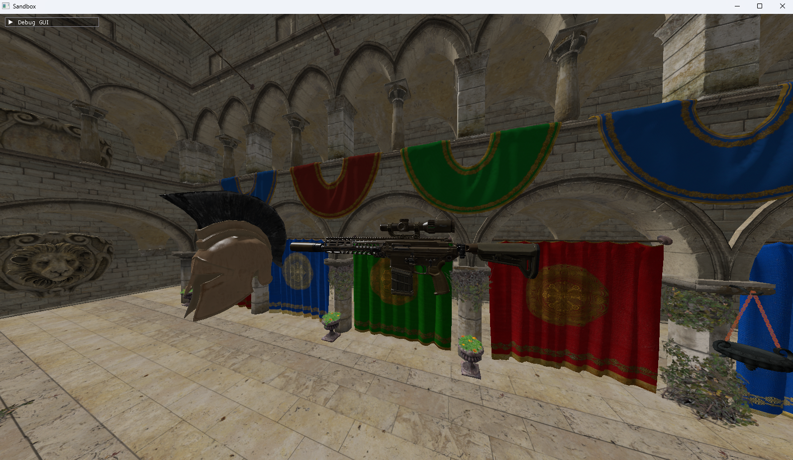

# Rigel Engine
Free and open source 3D rendering framework built with Vulkan in C++.

## Graphics showcase


## Features
- 3D Scene renderer built with Vulkan API.
- Multithreaded asset loading.
- Components-based architecture similar to unity.
- Scene system with GameObject lifecycle hooks (`OnLoad`, `OnStart`).
- Event system that minimizes redundant function invocations.
- Minimal input system that supports basic input events (`KeyDown`, 'MouseButtonDown', `MouseMove`, etc.).
- Custom handle system for engine objects such as `GameObject`, `Component`, `Asset`, etc.

## Project structure overview
The project is divided into 3 targets, all compiled together via CMakeLists file at the root directory. The targets are:
- Engine. This is the core engine project. It is compiled as a static library. 
  A Python script handles building assets bundled with the engine (e.g. Shaders) and grouping them into one folder in the output directory.
- Editor. Currently empty. At the very beginning of the project I envisioned editor to be a standalone application that linked the core engine library, 
  however at this moment I'm not sure if editor will remain to be developed as a standalone application, implemented as part of engine core
  or get discontinued altogether.
- Sandbox. This is just a playground I use to test newly implemented features during development.
  Right no it contains a simple demo scene with user controlled freecam you can use to fly around.
  Note that current sandbox demo uses assets (`Sponza.gltf`, `spear.glb`, `helmet.glb`) that are not included with this project.
  You'll  need to find or swap them on your own.

## Architecture overview
The core engine functionality is divided into modular subsystems managed by central `Engine` class. 
Only a single instance of any subsystem can exist at a time, and it's strictly responsibility of the `Engine` 
to start up and shut down the subsystems and manage their lifetime. 
Each subsystem is solely responsible for handling its part of engine's feature set.

Entity-Component System is implemented in a way similar to that of Unity engine. 
Each `Scene` is composed of multiple `GameObjects` and each `GameObject` includes a set of `Components`. 
`Component` holds the actual data and subscribes to engine events to manipulate that data.

The event system is centered around the `EventManager` subsystem. 
A callback (which can be a free function, a std::function or a class method) can be subscribed to any event type derived from Event base class. 
Components can subscribe to specific events (e.g., GameUpdateEvent, PhysicsTickEvent) to implement game logic and respond to engine-driven updates. 
Special lifetime events such as `OnLoad`, `OnStart`, `OnDestroy`, `OnEnable` and 
`OnDisable` bypass the `EventManager` and get invoked by the `GameObject` owning that component directly.

## Code examples
The most minimal framework setup looks something like this.
```cpp
#define RIGEL_ENABLE_HANDLE_VALIDATION
#include "RigelEngine.hpp"

int32_t main(int32_t argc, char** argv)
{
    auto settings = Rigel::ProjectSettings();
    settings.argc = argc;
    settings.argv = argv;
    settings.GameName = "Sandbox";
    settings.GameVersion = RIGEL_MAKE_VERSION(1, 0, 0);
    settings.TargetFPS = 165;
    settings.WindowTitle = "Sandbox";
    settings.WindowSize = glm::uvec2(1600, 900);
    settings.AssetManagerThreadPoolSize = 8;

    const auto engine = Rigel::Engine::CreateInstance();
    if (const auto errorCode = engine->Startup(settings); errorCode != Rigel::ErrorCode::OK)
    {
        Rigel::Debug::Error("Failed to initialize Rigel engine! Error code: {}.", static_cast<int32_t>(errorCode));
        return 1;
    }
    
    auto sceneManager = Rigel::GetSceneManager();

    auto scene = sceneManager->CreateScene();
    sceneManager->LoadScene(scene);

    engine->Run();
    engine->Shutdown();
}
```
You can instantiate custom `GameObjects` by doing this:
```cpp
auto scene = sceneManager->CreateScene();
auto object = scene->Instantiate("Optional object name");
```

You can write your own components in classes by following this pattern:
```cpp
#include "RigelEngine.hpp"

class ExampleComponent final : public Rigel::Component
{
public:
    // Every single component MUST use this macro.
    RIGEL_REGISTER_COMPONENT(ExampleComponent);

    NODISCARD nlohmann::json Serialize() const override
    {
    // Define your serialization logic here
        return Component::Serialize(); // Base method MUST be explicitly called
    }

    bool Deserialize(const nlohmann::json& json) override
    {
        // Define your deserialization logic here
        return Component::Deserialize(json); // Base method MUST be explicitly called
    }
private:
    // Every component MUST define default constructor and destructor
    ExampleComponent() = default;
    ~ExampleComponent() override = default;

    // Called once during object instantiation
    void OnStart() override
    {
        
    }
};
```

You can subscribe your components to global engine events like this:
```cpp
    void OnStart() override
    {
        // SubscribeEvent automatically binds this component instance to callback provided as argument
        SubscribeEvent<Rigel::GameUpdateEvent>(OnGameUpdate);
    }

    // Will be called every frame
    void OnGameUpdate()
    {
        if (Rigel::Input::GetKeyDown(Rigel::KeyCode::SPACE))
        {
            Rigel::Debug::Message("Printed from ExampleComponent!");
        }
    }
```
## Building and running the project
### Requirements
- CMake 3.28+
- Ninja build tool
- C++20 compatible compiler (gcc, msvc)
- Vulkan SDK 1.4+
- Python3

All other dependencies are compiled from source located in `Dependencies` directory.

### Build steps
`cd RigelEngine` to compile all 3 build targets at the same time.

Use the command below to generate build files. Note that CMAKE_BUILD_TYPE must be `Debug`, `Test` or `Release` only.

```bash
cmake -S . -B CMakeBuild -DCMAKE_BUILD_TYPE=Debug -G "Ninja"
```

Build the project using:
```bash
ninja -C CMakeBuild
```
## License
[MIT License](LICENCE.txt)